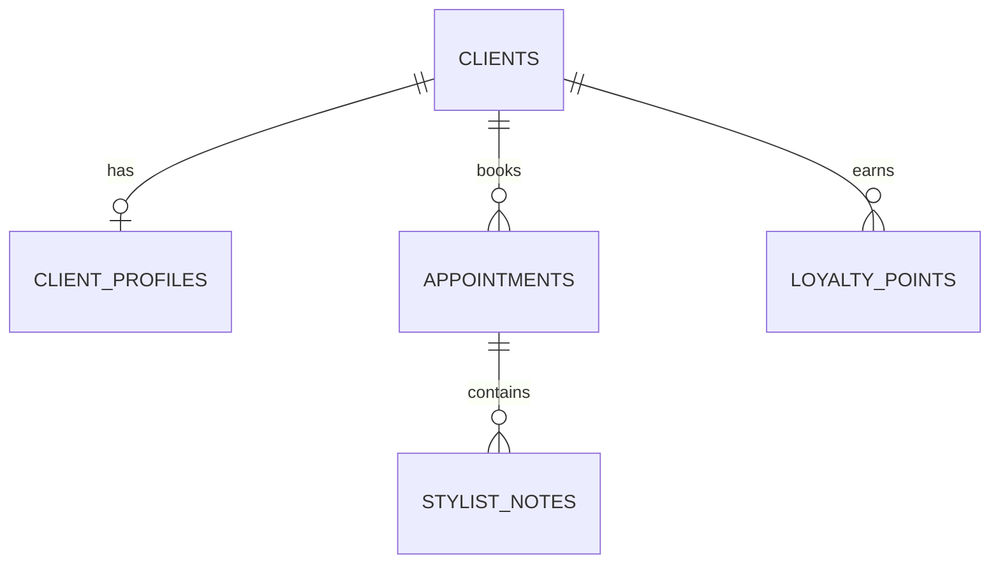

# Salon AI Client Management (CRM) Module: Product Specification & Scope Document

## 1. Executive Summary & CRM Goals

Client retention and personalized service are the cornerstones of a successful hair salon business. The **Salon AI Client Management (CRM) Module** expands the current check-in system by establishing comprehensive client profiles, capturing ongoing consultation history, mapping styling preferences, and introducing loyalty tracking.

### Key Goals:
*   **Historical Continuity**: Store and recall past consultations, style confirmations, and practitioner notes.
*   **Personalization**: Map individual hair characteristics, allergies, chemical history, and scalp profiles.
*   **Loyalty & Engagement**: Track repeat visits, calculate customer lifetime value, and support automated marketing campaigns.
*   **Stylist Enablement**: Provide a dashboard for stylists to review a client's profile before the consultation begins.

---

## 2. Advanced Client Profiling Structure

The CRM will record physical and history-based parameters to create a multi-dimensional client profile.

### Profiling Core Attributes:
1.  **Hair Metrics**:
    *   *Natural Color & Current Color Level* (1 to 10 scale).
    *   *Porosity* (Low, Medium, High) - impacts chemical processing time.
    *   *Elasticity* (Poor, Normal, Good) - determines hair strength.
    *   *Density* (Thin, Medium, Thick).
2.  **Scalp & Health Details**:
    *   *Scalp Type* (Dry, Oily, Normal, Sensitive).
    *   *Allergies* (PPD, Ammonia, Fragrances) - critical safety check for dye.
    *   *Chemical History* (Bleached, Relaxed, Permed, Virgin).
3.  **Preferences**:
    *   *Preferred Stylist* (ID reference).
    *   *Typical Maintenance Commitment* (Low, Moderate, High).
    *   *Preferred Consultation Mode* (Quiet, Conversational).

---

## 3. Database Schema Design

This section outlines the relational SQLite database structure required to support advanced CRM capabilities, linking client profiles directly to appointments and stylist logs.



### Table Definitions:

#### 1. `client_profiles`
Stores the detailed, static, and chemical characteristics of a client.
*   `client_id` INTEGER (Primary Key, Foreign Key referencing `clients(id)` ON DELETE CASCADE)
*   `hair_density` VARCHAR(20)
*   `hair_porosity` VARCHAR(20)
*   `hair_elasticity` VARCHAR(20)
*   `natural_color` VARCHAR(30)
*   `scalp_type` VARCHAR(30)
*   `chemical_treatment_history` TEXT (Comma-separated list of treatments)
*   `allergies` TEXT
*   `typical_maintenance` VARCHAR(20)
*   `updated_at` TIMESTAMP DEFAULT CURRENT_TIMESTAMP

#### 2. `appointments`
Tracks client bookings and maps them to consultations.
*   `id` INTEGER (Primary Key, Autoincrement)
*   `client_id` INTEGER (Foreign Key referencing `clients(id)`)
*   `appointment_date` TIMESTAMP (Not Null)
*   `stylist_id` INTEGER (User reference)
*   `status` VARCHAR(20) (e.g. 'scheduled', 'completed', 'cancelled')
*   `consultation_id` INTEGER (Optional, Foreign Key referencing `client_consultations(id)`)
*   `total_amount` DECIMAL(10, 2)
*   `created_at` TIMESTAMP DEFAULT CURRENT_TIMESTAMP

#### 3. `stylist_notes`
Chronological logs written by stylists after or during each visit.
*   `id` INTEGER (Primary Key, Autoincrement)
*   `appointment_id` INTEGER (Foreign Key referencing `appointments(id)` ON DELETE CASCADE)
*   `stylist_id` INTEGER (Not Null)
*   `note_type` VARCHAR(20) (e.g. 'formula', 'general_preference', 'complaint')
*   `content` TEXT (Not Null) (e.g., "Used Formula 7N + 20Vol on roots for 35 mins")
*   `created_at` TIMESTAMP DEFAULT CURRENT_TIMESTAMP

#### 4. `loyalty_points`
Tracks points gained by the client for booking or retail purchases.
*   `id` INTEGER (Primary Key, Autoincrement)
*   `client_id` INTEGER (Foreign Key referencing `clients(id)`)
*   `points_delta` INTEGER (Not Null) (Positive for earn, negative for redeem)
*   `reason` VARCHAR(100) (e.g. 'Appointment ID 45 Booking', 'Retail Purchase')
*   `created_at` TIMESTAMP DEFAULT CURRENT_TIMESTAMP

---

## 4. Stylist Workspace & History Panel

Stylists will interact with the CRM via a dedicated panel on their iPad/Tablet.

### UI Sections:
*   **Client At-A-Glance Card**: Top bar showing name, phone, allergies (highlighted in bold red), scalp sensitivity, and hair type.
*   **Color Formula Drawer**: A historical lookup of color codes and developers used in previous appointments (e.g., *"Root retouch: 5.0 + 6.1 + 20vol (1:1)"*).
*   **Interactive Style Timeline**: A horizontal scrollable gallery showing images from previous consultations side-by-side with confirmed styles. Stylists can tap any past card to load the exact recommendations and stylist notes from that visit.

---

## 5. API Endpoint Specifications

FastAPI endpoints to manage CRM profile data and appointment mappings.

### 1. `GET /api/crm/clients/{client_id}/profile`
Retrieve full client attributes, allergies, and color formulas.
*   **Response (200 OK)**:
    ```json
    {
      "client_id": 45,
      "name": "Jane Smith",
      "allergies": "PPD, Ammonia",
      "hair_metrics": {
        "density": "thick",
        "porosity": "high",
        "elasticity": "normal"
      },
      "chemical_history": "Bleached ends (March 2026), Permanent color (May 2026)",
      "color_formulas": [
        {
          "date": "2026-05-15",
          "formula": "6.32 + 20Vol developer",
          "stylist_name": "Sarah Jones"
        }
      ]
    }
    ```

### 2. `PUT /api/crm/clients/{client_id}/profile`
Update the client's hair metrics, allergies, or chemical records.
*   **Request Payload**:
    ```json
    {
      "hair_porosity": "medium",
      "allergies": "Ammonia, PPD, Latex",
      "typical_maintenance": "moderate"
    }
    ```
*   **Response (200 OK)**:
    ```json
    {
      "success": true,
      "updated_at": "2026-05-25T08:30:00Z"
    }
    ```

### 3. `POST /api/crm/appointments`
Link a completed consultation to an appointment and calculate loyalty points.
*   **Request Payload**:
    ```json
    {
      "client_id": 45,
      "appointment_date": "2026-05-25T10:00:00Z",
      "consultation_id": 102,
      "total_amount": 150.00
    }
    ```
*   **Response (200 OK)**:
    ```json
    {
      "appointment_id": 412,
      "loyalty_points_earned": 150,
      "status": "scheduled"
    }
    ```

---

## 6. Role-Based Access Control & Security

To ensure safety and privacy compliance, database access is gated by roles:

| Role | Client Profile View | Edit Color Formula | View Billing/History | Delete Record |
|---|---|---|---|---|
| **Receptionist** | Yes | No | Yes (Basic) | No |
| **Stylist** | Yes | Yes | Yes (Styling logs) | No |
| **Admin** | Yes | Yes | Yes (Full billing) | Yes |

*   **Data Protection**: Personal health data (allergies) and contact details (mobile numbers) are encrypted in the database.