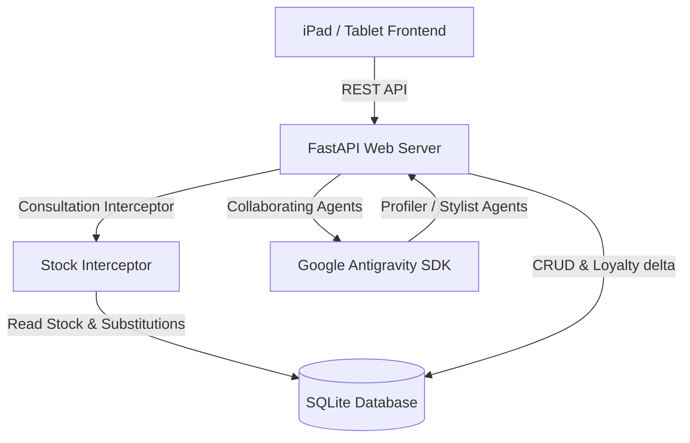

# Salon AI CRM & Inventory Management System How-To Guide

This guide describes the architecture, database schema, API specifications, and setup instructions for the Client Relationship Management (CRM) and Inventory modules.

---

## 1. Architectural Overview

The Salon AI platform is structured as a modular, tablet-optimized FastAPI and SQLite web application, utilizing multi-angle photography and collaborating AI agents to deliver personalized styling recommendations.



### Key Modules:
1. **Database Layer (`backend/app/database.py`)**: Manages the local SQLite database. Uses database-level triggers to automate visit and spent updates when transactions complete.
2. **CRM Module**: Tracks client details, physical hair metrics (density, porosity, elasticity, natural color, scalp type), allergy flags, chemical treatment logs, color formulas, styling histories, and loyalty points (1 point per INR spent).
3. **Inventory Control**: Manages products (retail/backbar) and raw materials with सेफ्टी stock levels, reorder logs, automatic supplier purchase order drafts, and stock transactions.
4. **AI Interceptor**: Automatically queries the inventory database before recommending products. If a recommended item is out of stock, it resolves and suggests an alternative in-stock item from the same category.

---

## 2. Database Schema

The SQLite schema initializes the following key tables:
*   `clients`: Core client data, visit counts, and total spending.
*   `client_profiles`: Styling diagnostics (density, porosity, scalp type, maintenance commitments).
*   `appointments`: Scheduled and completed treatments.
*   `transactions`: Invoice payments which trigger client stats updates.
*   `stylist_notes`: Technical remarks and color formula retouches.
*   `suppliers`: Supplier names, payment terms, and contact details.
*   `products`: Retail and professional backbar products with SKU and safety minimums.
*   `materials`: Raw materials tracked in weight/volume (grams, milliliters).
*   `stock_transactions`: Log of warehouse stock movement movements.
*   `client_consultations` & `client_confirmed_styles`: History of sessions and client confirmations.

---

## 3. API Specifications

### Client CRM API
*   `GET /api/crm/clients`: Retrieve directory list of clients.
*   `GET /api/crm/clients/{client_id}/profile`: Fetch diagnostic profiles, style timeline, and color formulas.
*   `PUT /api/crm/clients/{client_id}/profile`: Update scalp type, allergies, metrics, or maintenance commitments.
*   `POST /api/crm/appointments`: Book and complete appointments (awards loyalty points, increments visits and spent).

### Inventory Control API
*   `GET /api/inventory`: Fetch all products and raw materials with current stock levels. Supports filters for `category` and `low_stock` items.
*   `POST /api/inventory/transaction`: Record stock movements (`receive`, `sale`, `usage`, `adjustment`). Adjusts stock and returns safety alert flags.
*   `GET /api/inventory/alerts`: Check active safety alerts for low-stock items.
*   `GET /api/suppliers`: Fetch list of supplier contacts.

### AI Styling Interceptor
*   `POST /analyze`: Profiles multi-angle images, generates hairstyle recommendations, checks stock levels, performs substitutions, and records visual/video try-ons.
*   `POST /refine`: Refines suggestion history based on hairdresser feedback.

---

## 4. Setup & Running Local Tests

### Prerequisites
*   Python 3.10+
*   Virtual environment (`venv`) set up under `backend/venv`.

### Running Server Locally
1. Navigate to `backend/` and install dependencies:
   ```bash
   cd backend
   source venv/bin/activate
   pip install -r requirements.txt
   ```
2. Start the FastAPI server:
   ```bash
   python main.py
   ```
3. Open `http://localhost:8000/frontend/index.html` in your web browser.

### Running Offline Verification Tests
Run the FastAPI suite from the `backend/` directory:
```bash
PYTHONPATH=. ./venv/bin/python local_dev/test_inventory_crm.py
```
This runs 7 tests for database schema validation, CRUD operations, transactions, reorder alert triggers, and AI stock checks.
