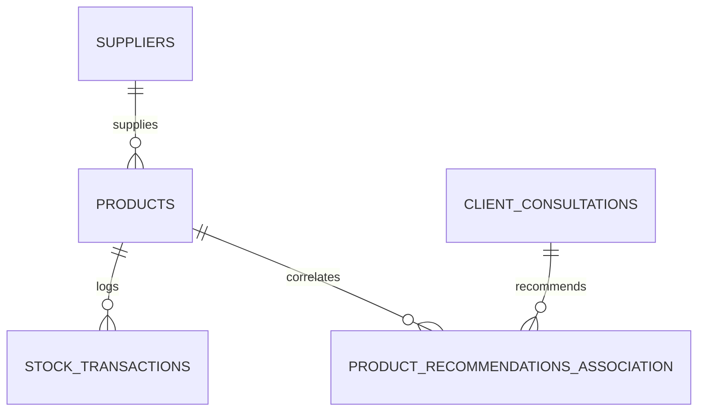
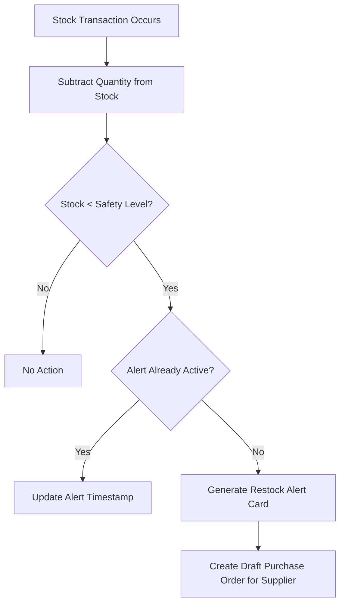

# Salon AI Inventory Management Module: Product Specification & Scope Document

## 1. Executive Summary & Objectives

Efficient management of salon inventory is crucial for minimizing overhead costs, avoiding stockouts of essential salon supplies (backbar products), and maximizing retail sales revenue. The **Salon AI Inventory Management Module** extends the existing Salon AI Recommendation platform by introducing real-time stock tracking, automatic restocking alerts, and supplier management.

### Key Objectives:
*   **Backbar supply tracking**: Monitor usage of professional consumption products (shampoos, hair dyes, developers, conditioners, neutralizers) during client appointments.
*   **Retail inventory optimization**: Monitor stock levels of retail products sold to customers, ensuring high-margin products are always available.
*   **Automated restocking**: Detect low-stock situations and automatically generate restock alerts or purchase orders.
*   **Stylist integration**: Cross-reference AI product recommendations with real-time stock levels.

---

## 2. Integration with AI Stylist Recommendation

To maximize retail conversions, the AI Stylist Agent must only recommend products that are currently in stock, or intelligently suggest alternatives when preferred products are unavailable.

### Workflow:
1.  **Recommendation Generation**: The Stylist Agent recommends a set of products required for a selected hairstyle (e.g., "Argan oil serum", "Hydrating leave-in conditioner").
2.  **Stock Checking Service**: A backend middleware intercepts these recommendations and queries the database for product availability.
3.  **Substitution Logic**:
    *   If the exact product is **in stock** (quantity > 0), the recommendation is displayed with an "In Stock" badge.
    *   If the product is **out of stock**, the system queries for alternative products matching the same product category (e.g. "Hair Oil/Serum") that are currently in stock.
    *   The AI Stylist updates the recommendation description to suggest the alternative product seamlessly (e.g., "We recommend applying [Alternative Product Name] as a substitute for [Preferred Product] to achieve a similar glossy finish").

---

## 3. Database Schema Design

The inventory module will utilize the existing SQLite database. The following schema defines the relationships between products, suppliers, stock transactions, and styling recommendations.



### Table definitions:

#### 1. `suppliers`
Tracks supplier contact details and shipping times.
*   `id` INTEGER (Primary Key, Autoincrement)
*   `name` VARCHAR(100) (Not Null)
*   `contact_name` VARCHAR(100)
*   `email` VARCHAR(100) (Unique)
*   `phone` VARCHAR(20)
*   `lead_time_days` INTEGER (Default 5)
*   `created_at` TIMESTAMP (Default CURRENT_TIMESTAMP)

#### 2. `products`
Stores details of backbar and retail products.
*   `id` INTEGER (Primary Key, Autoincrement)
*   `sku` VARCHAR(50) (Unique, Not Null)
*   `name` VARCHAR(100) (Not Null)
*   `description` TEXT
*   `category` VARCHAR(50) (e.g., 'Shampoo', 'Dye', 'Serum', 'Styling Gel')
*   `supplier_id` INTEGER (Foreign Key referencing `suppliers(id)`)
*   `product_type` VARCHAR(10) (e.g., 'retail' or 'backbar')
*   `cost_price` DECIMAL(10, 2) (Not Null)
*   `retail_price` DECIMAL(10, 2) (Null for backbar)
*   `quantity_in_stock` INTEGER (Not Null, Default 0)
*   `safety_stock_level` INTEGER (Not Null, Default 5)
*   `reorder_quantity` INTEGER (Not Null, Default 10)
*   `created_at` TIMESTAMP (Default CURRENT_TIMESTAMP)

#### 3. `stock_transactions`
Logs all additions and deductions to track historical usage.
*   `id` INTEGER (Primary Key, Autoincrement)
*   `product_id` INTEGER (Foreign Key referencing `products(id)`)
*   `transaction_type` VARCHAR(10) (e.g., 'receive', 'sale', 'usage', 'adjustment')
*   `quantity` INTEGER (Not Null, negative for deductions)
*   `reference_id` INTEGER (Optional, points to appointment_id or purchase_order_id)
*   `performed_by` VARCHAR(50) (User identifier)
*   `created_at` TIMESTAMP (Default CURRENT_TIMESTAMP)

#### 4. `product_recommendations_association`
Maps recommended products to specific client consultation outcomes.
*   `id` INTEGER (Primary Key, Autoincrement)
*   `consultation_id` INTEGER (Foreign Key referencing `client_consultations(id)`)
*   `product_id` INTEGER (Foreign Key referencing `products(id)`)
*   `status` VARCHAR(20) (e.g., 'recommended', 'substituted', 'purchased')
*   `created_at` TIMESTAMP (Default CURRENT_TIMESTAMP)

---

## 4. Restocking Alerts & Supplier Workflow

To maintain inventory health automatically, the system executes stock health checks triggered by stock transactions.



### Automatic Restocking Workflow:
1.  **Safety Stock Violation**: When `quantity_in_stock` falls below `safety_stock_level` for any product, a `LOW_STOCK` alert is triggered.
2.  **Dashboard Alert**: A notification card appears on the Admin/Receptionist dashboard showing the critical stock levels.
3.  **Purchase Order Generation**: The system aggregates all low-stock products from the same `supplier_id` and prepares a draft **Purchase Order (PO)** with `reorder_quantity`.
4.  **One-Click Order**: The administrator reviews the draft PO on the tablet and clicks "Email Order", which automatically sends a structured PDF order to the supplier's email address.

---

## 5. API Endpoint Specifications

The following REST API endpoints will be added to the FastAPI backend router to support inventory queries and operations.

### 1. `GET /api/inventory`
Retrieve current stock levels with category and supplier details.
*   **Query Parameters**:
    *   `category` (optional string): filter by category
    *   `low_stock` (optional boolean): filter only products below safety stock levels
*   **Response (200 OK)**:
    ```json
    {
      "products": [
        {
          "id": 12,
          "sku": "LOREAL-SH-500",
          "name": "L'Oreal Professional Hydrating Shampoo 500ml",
          "category": "Shampoo",
          "product_type": "retail",
          "quantity_in_stock": 3,
          "safety_stock_level": 5,
          "status": "critical"
        }
      ]
    }
    ```

### 2. `POST /api/inventory/transaction`
Log a manual inventory adjustment or product usage.
*   **Request Payload**:
    ```json
    {
      "product_id": 12,
      "transaction_type": "adjustment",
      "quantity": -2,
      "reference_id": null,
      "performed_by": "Stylist Sarah"
    }
    ```
*   **Response (200 OK)**:
    ```json
    {
      "success": true,
      "new_quantity": 1,
      "alert_triggered": true
    }
    ```

### 3. `GET /api/inventory/alerts`
List all active low-stock alerts and pending supplier orders.
*   **Response (200 OK)**:
    ```json
    {
      "alerts": [
        {
          "product_id": 12,
          "name": "L'Oreal Professional Hydrating Shampoo 500ml",
          "quantity_in_stock": 1,
          "safety_stock_level": 5,
          "supplier_name": "L'Oreal Elite Distributors"
        }
      ]
    }
    ```

---

## 6. UI/UX Wireframe Guidelines

For a fluid experience on iPad and tablets, the inventory UI should follow these layouts:

### Dashboard Grid:
*   **Visual Highlights**: Products with critical stock levels (`quantity_in_stock <= safety_stock_level`) are highlighted in HSL-themed amber or red warning blocks.
*   **Interactive Cards**: Each warning card has a quick button to "Approve PO" or "Log Shipment Received".
*   **Quick Scan Interface**: Stylists can use the iPad camera to scan product barcodes, which automatically decrements the backbar inventory by 1 unit for a quick log.

### Styling Consultation Integration:
*   In the Stylist view, product recommendation lists display a small green checkmark icon if in stock, or a gray dotted warning sign if out of stock, offering a one-click substitute dropdown menu.